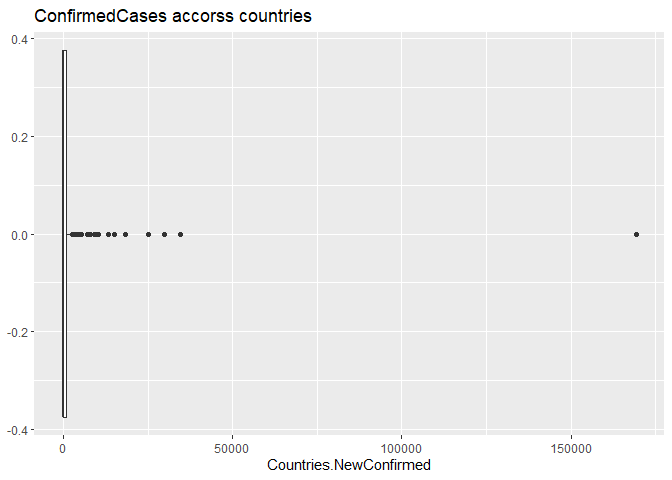

COVID19 API
================
Ipsita Datta
9/28/2021

     This document is a vignette to show how to retrieve data from Covid19API.To demonstrate, I'll be interacting with the Covid19 API. I am going to build a few functions to interact with some of the endpoints and explore some of the data I can retrieve.

– The most difficult part of the logic and programming for me is to make
a requirement or what I should analysis and how I am going to implement
that.

– In,future, First I will sketch a project outline like what are the
things is going to discuss or what are the data I should fetch from API.

# Requirements

To use the functions for interacting with the API, I used the following
packages:

-   [`tidyverse`](https://www.tidyverse.org/): useful features for data
    manipulation and visualization
-   [`jsonlite`](https://cran.r-project.org/web/packages/jsonlite/): API
    interaction
-   [`httr`](https://cran.r-project.org/web/packages/httr/index.html):
    For using function to interact with API

# API Interaction Functions

Here are the functions to interact with Covid19 API. \#\#
`CountriesName`

I wrote this function to interact with the `CountriesName` endpoint of
the Covid19 API.It returns all countries and associated provinces. The
country\_slug variable is used for country specific data

``` r
Country <-function(CountryName ="all"){
    #Returns all the available countries and provinces, as well as the country slug for per country requests.
  outputAPI<-GET("https://api.covid19api.com/countries")
  output<- outputAPI$content %>% rawToChar() %>% fromJSON()
  if ( CountryName != "all"){
         #if country name is in country
         if (CountryName %in% output$Country){
         # subset output for just that row.
         output<-output %>% filter(Country == CountryName)
         }
         # if country code in country slug
         else if (CountryName %in% output$Slug ){
          output<-output %>% filter(Slug == CountryName) 
         }
         # if country name is in countrycode/ISO2
         else if (CountryName %in% output$ISO2 ){
          output<-output %>% filter(CountryCode == CountryName) 
         }
  }
    # Return the output data.frame.
  
  return(output)
}
```

## `summary`

This function returns current cases for all the country and can also
return for single country if name passed as argument.

``` r
summary<-function(CountryName ="all"){
         ## Get all the number of cases from the summary endpoint.
         outputAPI<-fromJSON("https://api.covid19api.com/summary")
         output<-outputAPI$Countries
         if ( CountryName != "all"){
         #if country name is in country
         if (CountryName %in% output$Country){
         # subset output for just that row.
         output<-output %>% filter(Country == CountryName)
         }
         # if country name is in countrycode
         else if (CountryName %in% output$CountryCode ){
          output<-output %>% filter(CountryCode == CountryName) 
         }
         # if country code in country slug
         else if (CountryName %in% output$Slug ){
          output<-output %>% filter(Slug == CountryName) 
         }
          # Otherwise, throw an informative error.
          else {
          message <- paste("ERROR: Argument for country was not found in either","the Country or CountryCode or Slug columns. Try Countries('all') to","find the CountryName you're looking for.")
      stop(message)
          }
}
          # Do nothing if the Country value equals "all".
else {
    
     }
        # Return the output data.frame.
        return(output)
}
```

## `USAdetail`

Returns all live cases for All provinces of USA. It can be use for a
particular province with particular case type of USA too.These records
are pulled every 10 minutes and are ungrouped. Country must be the slug
from /countries or /summary. Cases must be one of: Deaths,Confirmed
,Active,Recovered

``` r
USAdetail<-function(ProvinceName ="all",type  ){
    baseurl<-"https://api.covid19api.com/live/country/united-states"
     output<-fromJSON(baseurl)
    # If Province does not equal "all", check if it is a Province .
        if (ProvinceName != "all" ){
           # If Province is in the Province column, subset output for just that row.
             if (ProvinceName %in% output$Province){
                 output <- output %>%
                           filter(ProvinceName == Province) %>% select(all_of(type),Province)
            }
            # Otherwise, warn the user and return the entire dataframe.
            else {
            message <- paste("WARNING: Argument for Province was not found in either",
                       "the Province  columns. Returning all",
                       "or type should be Deaths,Confirmed ,Active,Recovered.")
           warning(message)
            }
          return(output)
         }
        # Do nothing if the province value equals "all".
        else {# Return the output data.frame.
              return(output)
              }
}
```

## `CountryDatabycase`

Get List Of Cases Per Country By Case Type From The First Recorded
Case.Returns all cases by case type for a country from the first
recorded case. Country must be the country\_slug from /countries. Cases
must be one of: confirmed, recovered, deaths or Active.

``` r
CountryDatabycase<-function(Country ="all",Status){
if (Country != "all"){
baseurl<-"https://api.covid19api.com/dayone/country/"
path1<-paste0(baseurl,Country)
endpoints<-"/status/"
fullurl<-paste0(path1,endpoints,Status)
outputAPI <-fromJSON(fullurl)
return(outputAPI)
}
  else{message <- paste("ERROR: Argument for country was not found in  Country ")
      stop(message)
  }
}
```

## `Allcasesbycountry`

Returns all cases by case type for a country from the first recorded
case. Country must be the Slug from /countries or /summary. Cases must
be one of: confirmed, recovered, deaths or Active

``` r
Allcasesbycountry<-function(Country ="all" ,type){
if (Country != "all"){
baseurl<-"https://api.covid19api.com/dayone/country/"
fullurl<-paste0(baseurl,Country)
outputAPI<-fromJSON(fullurl)
output<- outputAPI %>% select(Country,type)
return(output)
}
else{message <- paste("ERROR: Argument for country was not found in  Country ")
      stop(message)
}
}
Allcasesbycountry("Switzerland","Confirmed")
```

    ##         Country Confirmed
    ## 1   Switzerland         1
    ## 2   Switzerland         1
    ## 3   Switzerland         8
    ## 4   Switzerland         8
    ## 5   Switzerland        18
    ## 6   Switzerland        27
    ## 7   Switzerland        42
    ## 8   Switzerland        56
    ## 9   Switzerland        90
    ## 10  Switzerland       114
    ## 11  Switzerland       214
    ## 12  Switzerland       268
    ## 13  Switzerland       337
    ## 14  Switzerland       374
    ## 15  Switzerland       491
    ## 16  Switzerland       652
    ## 17  Switzerland       652
    ## 18  Switzerland      1139
    ## 19  Switzerland      1359
    ## 20  Switzerland      2200
    ## 21  Switzerland      2200
    ## 22  Switzerland      2700
    ## 23  Switzerland      3028
    ## 24  Switzerland      4075
    ## 25  Switzerland      5294
    ## 26  Switzerland      6575
    ## 27  Switzerland      7474
    ## 28  Switzerland      8795
    ## 29  Switzerland      9877
    ## 30  Switzerland     10897
    ## 31  Switzerland     11811
    ## 32  Switzerland     12928
    ## 33  Switzerland     14076
    ## 34  Switzerland     14829
    ## 35  Switzerland     15922
    ## 36  Switzerland     16605
    ## 37  Switzerland     17768
    ## 38  Switzerland     18827
    ## 39  Switzerland     19606
    ## 40  Switzerland     20505
    ## 41  Switzerland     21100
    ## 42  Switzerland     21657
    ## 43  Switzerland     22253
    ## 44  Switzerland     23280
    ## 45  Switzerland     24051
    ## 46  Switzerland     24551
    ## 47  Switzerland     25107
    ## 48  Switzerland     25415
    ## 49  Switzerland     25688
    ## 50  Switzerland     25936
    ## 51  Switzerland     26336
    ## 52  Switzerland     26732
    ## 53  Switzerland     27078
    ## 54  Switzerland     27404
    ## 55  Switzerland     27740
    ## 56  Switzerland     27944
    ## 57  Switzerland     28063
    ## 58  Switzerland     28268
    ## 59  Switzerland     28496
    ## 60  Switzerland     28677
    ## 61  Switzerland     28894
    ## 62  Switzerland     29061
    ## 63  Switzerland     29164
    ## 64  Switzerland     29264
    ## 65  Switzerland     29407
    ## 66  Switzerland     29586
    ## 67  Switzerland     29705
    ## 68  Switzerland     29817
    ## 69  Switzerland     29905
    ## 70  Switzerland     29981
    ## 71  Switzerland     30009
    ## 72  Switzerland     30060
    ## 73  Switzerland     30126
    ## 74  Switzerland     30207
    ## 75  Switzerland     30251
    ## 76  Switzerland     30305
    ## 77  Switzerland     30344
    ## 78  Switzerland     30380
    ## 79  Switzerland     30413
    ## 80  Switzerland     30463
    ## 81  Switzerland     30514
    ## 82  Switzerland     30572
    ## 83  Switzerland     30587
    ## 84  Switzerland     30597
    ## 85  Switzerland     30618
    ## 86  Switzerland     30658
    ## 87  Switzerland     30694
    ## 88  Switzerland     30707
    ## 89  Switzerland     30725
    ## 90  Switzerland     30736
    ## 91  Switzerland     30746
    ## 92  Switzerland     30761
    ## 93  Switzerland     30776
    ## 94  Switzerland     30796
    ## 95  Switzerland     30828
    ## 96  Switzerland     30845
    ## 97  Switzerland     30862
    ## 98  Switzerland     30871
    ## 99  Switzerland     30874
    ## 100 Switzerland     30893
    ## 101 Switzerland     30913
    ## 102 Switzerland     30936
    ## 103 Switzerland     30956
    ## 104 Switzerland     30965
    ## 105 Switzerland     30972
    ## 106 Switzerland     30988
    ## 107 Switzerland     31011
    ## 108 Switzerland     31044
    ## 109 Switzerland     31063
    ## 110 Switzerland     31094
    ## 111 Switzerland     31117
    ## 112 Switzerland     31131
    ## 113 Switzerland     31154
    ## 114 Switzerland     31187
    ## 115 Switzerland     31200
    ## 116 Switzerland     31235
    ## 117 Switzerland     31243
    ## 118 Switzerland     31292
    ## 119 Switzerland     31310
    ## 120 Switzerland     31332
    ## 121 Switzerland     31376
    ## 122 Switzerland     31428
    ## 123 Switzerland     31486
    ## 124 Switzerland     31555
    ## 125 Switzerland     31617
    ## 126 Switzerland     31652
    ## 127 Switzerland     31714
    ## 128 Switzerland     31851
    ## 129 Switzerland     31967
    ## 130 Switzerland     32101
    ## 131 Switzerland     32198
    ## 132 Switzerland     32268
    ## 133 Switzerland     32315
    ## 134 Switzerland     32369
    ## 135 Switzerland     32498
    ## 136 Switzerland     32586
    ## 137 Switzerland     32690
    ## 138 Switzerland     32817
    ## 139 Switzerland     32883
    ## 140 Switzerland     32946
    ## 141 Switzerland     33016
    ## 142 Switzerland     33148
    ## 143 Switzerland     33290
    ## 144 Switzerland     33382
    ## 145 Switzerland     33492
    ## 146 Switzerland     33591
    ## 147 Switzerland     33634
    ## 148 Switzerland     33742
    ## 149 Switzerland     33883
    ## 150 Switzerland     34000
    ## 151 Switzerland     34154
    ## 152 Switzerland     34302
    ## 153 Switzerland     34412
    ## 154 Switzerland     34477
    ## 155 Switzerland     34609
    ## 156 Switzerland     34802
    ## 157 Switzerland     35022
    ## 158 Switzerland     35232
    ## 159 Switzerland     35412
    ## 160 Switzerland     35550
    ## 161 Switzerland     35616
    ## 162 Switzerland     35746
    ## 163 Switzerland     35927
    ## 164 Switzerland     36108
    ## 165 Switzerland     36269
    ## 166 Switzerland     36451
    ## 167 Switzerland     36603
    ## 168 Switzerland     36708
    ## 169 Switzerland     36895
    ## 170 Switzerland     37169
    ## 171 Switzerland     37403
    ## 172 Switzerland     37671
    ## 173 Switzerland     37924
    ## 174 Switzerland     38124
    ## 175 Switzerland     38252
    ## 176 Switzerland     38449
    ## 177 Switzerland     38760
    ## 178 Switzerland     39026
    ## 179 Switzerland     39332
    ## 180 Switzerland     39627
    ## 181 Switzerland     39903
    ## 182 Switzerland     40060
    ## 183 Switzerland     40262
    ## 184 Switzerland     40645
    ## 185 Switzerland     41006
    ## 186 Switzerland     41346
    ## 187 Switzerland     41722
    ## 188 Switzerland     42014
    ## 189 Switzerland     42177
    ## 190 Switzerland     42393
    ## 191 Switzerland     42763
    ## 192 Switzerland     43127
    ## 193 Switzerland     43532
    ## 194 Switzerland     43957
    ## 195 Switzerland     44401
    ## 196 Switzerland     44592
    ## 197 Switzerland     44837
    ## 198 Switzerland     45306
    ## 199 Switzerland     45711
    ## 200 Switzerland     46239
    ## 201 Switzerland     46704
    ## 202 Switzerland     47179
    ## 203 Switzerland     47436
    ## 204 Switzerland     47751
    ## 205 Switzerland     48265
    ## 206 Switzerland     48795
    ## 207 Switzerland     49283
    ## 208 Switzerland     49283
    ## 209 Switzerland     49283
    ## 210 Switzerland     50378
    ## 211 Switzerland     50664
    ## 212 Switzerland     51101
    ## 213 Switzerland     51492
    ## 214 Switzerland     51864
    ## 215 Switzerland     51864
    ## 216 Switzerland     51864
    ## 217 Switzerland     52646
    ## 218 Switzerland     52871
    ## 219 Switzerland     53282
    ## 220 Switzerland     53832
    ## 221 Switzerland     54384
    ## 222 Switzerland     54384
    ## 223 Switzerland     54384
    ## 224 Switzerland     55932
    ## 225 Switzerland     56632
    ## 226 Switzerland     57709
    ## 227 Switzerland     58881
    ## 228 Switzerland     60368
    ## 229 Switzerland     60368
    ## 230 Switzerland     60368
    ## 231 Switzerland     64436
    ## 232 Switzerland     65881
    ## 233 Switzerland     68704
    ## 234 Switzerland     71317
    ## 235 Switzerland     74422
    ## 236 Switzerland     74422
    ## 237 Switzerland     74422
    ## 238 Switzerland     83159
    ## 239 Switzerland     86167
    ## 240 Switzerland     91763
    ## 241 Switzerland     97019
    ## 242 Switzerland    103653
    ## 243 Switzerland    103653
    ## 244 Switzerland    103653
    ## 245 Switzerland    121093
    ## 246 Switzerland    127042
    ## 247 Switzerland    135658
    ## 248 Switzerland    145044
    ## 249 Switzerland    154251
    ## 250 Switzerland    154251
    ## 251 Switzerland    154251
    ## 252 Switzerland    176177
    ## 253 Switzerland    182303
    ## 254 Switzerland    192376
    ## 255 Switzerland    202504
    ## 256 Switzerland    211913
    ## 257 Switzerland    211913
    ## 258 Switzerland    211913
    ## 259 Switzerland    229222
    ## 260 Switzerland    235202
    ## 261 Switzerland    243472
    ## 262 Switzerland    250396
    ## 263 Switzerland    257135
    ## 264 Switzerland    257135
    ## 265 Switzerland    257135
    ## 266 Switzerland    269974
    ## 267 Switzerland    274534
    ## 268 Switzerland    280648
    ## 269 Switzerland    285655
    ## 270 Switzerland    290601
    ## 271 Switzerland    290601
    ## 272 Switzerland    290601
    ## 273 Switzerland    300352
    ## 274 Switzerland    304593
    ## 275 Switzerland    309469
    ## 276 Switzerland    313978
    ## 277 Switzerland    318290
    ## 278 Switzerland    318290
    ## 279 Switzerland    318290
    ## 280 Switzerland    327072
    ## 281 Switzerland    330874
    ## 282 Switzerland    335660
    ## 283 Switzerland    340115
    ## 284 Switzerland    344497
    ## 285 Switzerland    344497
    ## 286 Switzerland    344497
    ## 287 Switzerland    354306
    ## 288 Switzerland    358568
    ## 289 Switzerland    363654
    ## 290 Switzerland    368695
    ## 291 Switzerland    373831
    ## 292 Switzerland    373831
    ## 293 Switzerland    373831
    ## 294 Switzerland    384557
    ## 295 Switzerland    388828
    ## 296 Switzerland    394453
    ## 297 Switzerland    399511
    ## 298 Switzerland    403989
    ## 299 Switzerland    403989
    ## 300 Switzerland    403989
    ## 301 Switzerland    413991
    ## 302 Switzerland    418266
    ## 303 Switzerland    423299
    ## 304 Switzerland    428197
    ## 305 Switzerland    428197
    ## 306 Switzerland    428197
    ## 307 Switzerland    428197
    ## 308 Switzerland    438284
    ## 309 Switzerland    442481
    ## 310 Switzerland    447905
    ## 311 Switzerland    452296
    ## 312 Switzerland    452296
    ## 313 Switzerland    452296
    ## 314 Switzerland    452296
    ## 315 Switzerland    461961
    ## 316 Switzerland    465981
    ## 317 Switzerland    470789
    ## 318 Switzerland    474764
    ## 319 Switzerland    477983
    ## 320 Switzerland    477983
    ## 321 Switzerland    477983
    ## 322 Switzerland    484506
    ## 323 Switzerland    487357
    ## 324 Switzerland    490358
    ## 325 Switzerland    492832
    ## 326 Switzerland    495228
    ## 327 Switzerland    495228
    ## 328 Switzerland    495228
    ## 329 Switzerland    499931
    ## 330 Switzerland    502191
    ## 331 Switzerland    504918
    ## 332 Switzerland    507123
    ## 333 Switzerland    509279
    ## 334 Switzerland    509279
    ## 335 Switzerland    509279
    ## 336 Switzerland    513599
    ## 337 Switzerland    515483
    ## 338 Switzerland    517705
    ## 339 Switzerland    519404
    ## 340 Switzerland    521320
    ## 341 Switzerland    521320
    ## 342 Switzerland    521320
    ## 343 Switzerland    525095
    ## 344 Switzerland    526728
    ## 345 Switzerland    528524
    ## 346 Switzerland    530289
    ## 347 Switzerland    531873
    ## 348 Switzerland    531873
    ## 349 Switzerland    531873
    ## 350 Switzerland    535153
    ## 351 Switzerland    536516
    ## 352 Switzerland    538118
    ## 353 Switzerland    539474
    ## 354 Switzerland    540727
    ## 355 Switzerland    540727
    ## 356 Switzerland    540727
    ## 357 Switzerland    543207
    ## 358 Switzerland    544282
    ## 359 Switzerland    545535
    ## 360 Switzerland    546754
    ## 361 Switzerland    547775
    ## 362 Switzerland    547775
    ## 363 Switzerland    547775
    ## 364 Switzerland    550224
    ## 365 Switzerland    551355
    ## 366 Switzerland    552698
    ## 367 Switzerland    553867
    ## 368 Switzerland    554932
    ## 369 Switzerland    554932
    ## 370 Switzerland    554932
    ## 371 Switzerland    557492
    ## 372 Switzerland    558622
    ## 373 Switzerland    559845
    ## 374 Switzerland    561068
    ## 375 Switzerland    562290
    ## 376 Switzerland    562290
    ## 377 Switzerland    562290
    ## 378 Switzerland    565034
    ## 379 Switzerland    566412
    ## 380 Switzerland    567903
    ## 381 Switzerland    569312
    ## 382 Switzerland    570645
    ## 383 Switzerland    570645
    ## 384 Switzerland    570645
    ## 385 Switzerland    573815
    ## 386 Switzerland    575253
    ## 387 Switzerland    577111
    ## 388 Switzerland    578861
    ## 389 Switzerland    580609
    ## 390 Switzerland    580609
    ## 391 Switzerland    580609
    ## 392 Switzerland    584252
    ## 393 Switzerland    586096
    ## 394 Switzerland    588118
    ## 395 Switzerland    590164
    ## 396 Switzerland    592217
    ## 397 Switzerland    592217
    ## 398 Switzerland    592217
    ## 399 Switzerland    596790
    ## 400 Switzerland    598713
    ## 401 Switzerland    601124
    ## 402 Switzerland    603092
    ## 403 Switzerland    605342
    ## 404 Switzerland    605342
    ## 405 Switzerland    605342
    ## 406 Switzerland    605342
    ## 407 Switzerland    610274
    ## 408 Switzerland    612575
    ## 409 Switzerland    615024
    ## 410 Switzerland    617543
    ## 411 Switzerland    617543
    ## 412 Switzerland    617543
    ## 413 Switzerland    623126
    ## 414 Switzerland    625367
    ## 415 Switzerland    627968
    ## 416 Switzerland    630194
    ## 417 Switzerland    632399
    ## 418 Switzerland    632399
    ## 419 Switzerland    632399
    ## 420 Switzerland    637304
    ## 421 Switzerland    639445
    ## 422 Switzerland    642131
    ## 423 Switzerland    644396
    ## 424 Switzerland    646509
    ## 425 Switzerland    646509
    ## 426 Switzerland    646509
    ## 427 Switzerland    651822
    ## 428 Switzerland    653957
    ## 429 Switzerland    656077
    ## 430 Switzerland    658143
    ## 431 Switzerland    659974
    ## 432 Switzerland    659974
    ## 433 Switzerland    659974
    ## 434 Switzerland    663952
    ## 435 Switzerland    665585
    ## 436 Switzerland    667380
    ## 437 Switzerland    669067
    ## 438 Switzerland    670613
    ## 439 Switzerland    670613
    ## 440 Switzerland    670613
    ## 441 Switzerland    674296
    ## 442 Switzerland    675671
    ## 443 Switzerland    677210
    ## 444 Switzerland    677210
    ## 445 Switzerland    679510
    ## 446 Switzerland    679510
    ## 447 Switzerland    679510
    ## 448 Switzerland    682160
    ## 449 Switzerland    683400
    ## 450 Switzerland    684954
    ## 451 Switzerland    686152
    ## 452 Switzerland    686152
    ## 453 Switzerland    687353
    ## 454 Switzerland    687353
    ## 455 Switzerland    687353
    ## 456 Switzerland    690123
    ## 457 Switzerland    691119
    ## 458 Switzerland    692111
    ## 459 Switzerland    693023
    ## 460 Switzerland    693023
    ## 461 Switzerland    693023
    ## 462 Switzerland    694740
    ## 463 Switzerland    695496
    ## 464 Switzerland    696213
    ## 465 Switzerland    696801
    ## 466 Switzerland    697292
    ## 467 Switzerland    697292
    ## 468 Switzerland    697292
    ## 469 Switzerland    698369
    ## 470 Switzerland    698798
    ## 471 Switzerland    698798
    ## 472 Switzerland    699697
    ## 473 Switzerland    700051
    ## 474 Switzerland    700051
    ## 475 Switzerland    700051
    ## 476 Switzerland    700735
    ## 477 Switzerland    700978
    ## 478 Switzerland    701260
    ## 479 Switzerland    701454
    ## 480 Switzerland    701627
    ## 481 Switzerland    701627
    ## 482 Switzerland    701627
    ## 483 Switzerland    701994
    ## 484 Switzerland    702124
    ## 485 Switzerland    702278
    ## 486 Switzerland    702398
    ## 487 Switzerland    702507
    ## 488 Switzerland    702507
    ## 489 Switzerland    702507
    ## 490 Switzerland    702746
    ## 491 Switzerland    702875
    ## 492 Switzerland    703004
    ## 493 Switzerland    703176
    ## 494 Switzerland    703334
    ## 495 Switzerland    703334
    ## 496 Switzerland    703334
    ## 497 Switzerland    703783
    ## 498 Switzerland    704057
    ## 499 Switzerland    704352
    ## 500 Switzerland    704620
    ##  [ reached 'max' / getOption("max.print") -- omitted 89 rows ]

## `LiveCount`

Returns all cases by case type for a country from the first recorded
case with the latest record being the live count. Country must be the
Slug from /countries or /summary. Cases must be one of: confirmed,
recovered, deaths

``` r
Livecount<-function(Country="all",type){
if (Country !="all"){
baseurl<-"https://api.covid19api.com/dayone/country/"
path1<-paste0(baseurl,Country)
fullurl<-paste0(path1,"/status/",type,"/live")
outputAPI<-fromJSON(fullurl)
return(outputAPI)
}
  else{message <- paste("ERROR: Argument for country was not found in  Country ")
      stop(message) }
}
#Livecount("iran","confirmed")
```

# Data Exploration

Now that we can interact with a few of the endpoints of the Covid19 API,
let’s get some data from them.<br>

First, let’s pull A function returns current cases for all the country
along with global cases

``` r
# Get the current cases for all of the country .
currentData<- summary()
```

Second, let’s pull a function returns cases by type for USA provinces.

``` r
#Get all the cases of unites-states.
currentData1<-USAdetail("Utah","Deaths")
currentData2<-USAdetail("Utah","Recovered")
Data<-cbind(currentData1,currentData2)
```

Now two variable of interest for me are detahrate and newconfirmed rate
per countries.

``` r
# Add a column for the death per 100
currentData <- currentData %>%
  mutate(deathRate = round((NewDeaths*10000 )/ TotalDeaths,0),NewconfirmRate=round((NewConfirmed*10000 )/ TotalConfirmed,0)) %>% select (Country,deathRate,NewconfirmRate)
currentData
```

    ##                             Country deathRate NewconfirmRate
    ## 1                       Afghanistan         3              1
    ## 2                           Albania        44             48
    ## 3                           Algeria         9              6
    ## 4                           Andorra         0              3
    ## 5                            Angola        63            159
    ## 6               Antigua and Barbuda         0              0
    ## 7                         Argentina         3              2
    ## 8                           Armenia        41             33
    ## 9                         Australia        81            206
    ## 10                          Austria        14             12
    ## 11                       Azerbaijan        23             17
    ## 12                          Bahamas         0              0
    ## 13                          Bahrain         7              3
    ## 14                       Bangladesh         8              4
    ## 15                         Barbados         0              0
    ## 16                          Belarus        28             36
    ## 17                          Belgium         8             37
    ## 18                           Belize         0              0
    ## 19                            Benin         0              0
    ## 20                           Bhutan         0             19
    ## 21                          Bolivia         0              0
    ## 22           Bosnia and Herzegovina        44             31
    ## 23                         Botswana        25             54
    ## 24                           Brazil         3              5
    ## 25                Brunei Darussalam         0            174
    ## 26                         Bulgaria        49             56
    ## 27                     Burkina Faso       209             10
    ## 28                          Burundi         0            177
    ## 29                         Cambodia        50             20
    ## 30                         Cameroon         0              0
    ## 31                           Canada        12             32
    ## 32                       Cape Verde        87             16
    ## 33         Central African Republic         0              0
    ## 34                             Chad         0             10
    ## 35                            Chile         2              4
    ## 36                            China         0              3
    ## 37                         Colombia         2              2
    ## 38                          Comoros         0              2
    ## 39              Congo (Brazzaville)         0              0
    ## 40                 Congo (Kinshasa)         0              0
    ## 41                       Costa Rica        43             28
    ## 42                          Croatia        22             26
    ## 43                             Cuba        59             53
    ## 44                           Cyprus        18             10
    ## 45                   Czech Republic         2              5
    ## 46                    Côte d'Ivoire       184              9
    ## 47                          Denmark         0              0
    ## 48                         Djibouti       115             62
    ## 49                         Dominica         0              0
    ## 50               Dominican Republic         2             19
    ## 51                          Ecuador         0              0
    ## 52                            Egypt        22             25
    ## 53                      El Salvador        57              0
    ## 54                Equatorial Guinea         0              0
    ## 55                          Eritrea         0              3
    ## 56                          Estonia        65             56
    ## 57                         Ethiopia        79             28
    ## 58                             Fiji        63             10
    ## 59                          Finland         0             40
    ## 60                           France         0              0
    ## 61                            Gabon         0              0
    ## 62                           Gambia         0              0
    ## 63                          Georgia        46             45
    ## 64                          Germany         9             11
    ## 65                            Ghana         9             31
    ## 66                           Greece        23             46
    ## 67                          Grenada         0              0
    ## 68                        Guatemala        32             49
    ## 69                           Guinea        52              2
    ## 70                    Guinea-Bissau         0              0
    ## 71                           Guyana         0              0
    ## 72                            Haiti       113             69
    ## 73    Holy See (Vatican City State)       NaN              0
    ## 74                         Honduras         0              0
    ## 75                          Hungary         5              4
    ## 76                          Iceland         0             27
    ## 77                            India         6              5
    ## 78                        Indonesia         5              3
    ## 79        Iran, Islamic Republic of        18             23
    ## 80                             Iraq        12             12
    ## 81                          Ireland         0             28
    ## 82                           Israel        15             22
    ## 83                            Italy         3              3
    ## 84                          Jamaica        72             29
    ## 85                            Japan        14              4
    ## 86                           Jordan         8             13
    ## 87                       Kazakhstan        24              0
    ## 88                            Kenya        17              8
    ## 89                         Kiribati       NaN              0
    ## 90                    Korea (South)         0              0
    ## 91                           Kuwait         0              1
    ## 92                       Kyrgyzstan         8              4
    ## 93                          Lao PDR         0            178
    ## 94                           Latvia        51             62
    ## 95                          Lebanon         8             12
    ## 96                          Lesotho         0              0
    ## 97                          Liberia         0              0
    ## 98                            Libya        17             20
    ## 99                    Liechtenstein         0              0
    ## 100                       Lithuania        57             46
    ## 101                      Luxembourg         0             13
    ## 102          Macedonia, Republic of        31             21
    ## 103                      Madagascar         0              0
    ## 104                          Malawi         9              2
    ## 105                        Malaysia        28             35
    ## 106                        Maldives         0             11
    ## 107                            Mali        18             22
    ## 108                           Malta         0              7
    ## 109                Marshall Islands       NaN              0
    ## 110                      Mauritania        51             18
    ## 111                       Mauritius         0              0
    ## 112                          Mexico        18             14
    ## 113 Micronesia, Federated States of       NaN              0
    ## 114                         Moldova        35             51
    ## 115                          Monaco         0             21
    ## 116                        Mongolia       110             71
    ## 117                      Montenegro        56             31
    ## 118                         Morocco        12              7
    ## 119                      Mozambique         0              1
    ## 120                         Myanmar        20             32
    ## 121                         Namibia         0              5
    ## 122                           Nepal         5             10
    ## 123                     Netherlands         1              8
    ## 124                     New Zealand         0              0
    ## 125                       Nicaragua         0              0
    ## 126                           Niger         0              0
    ## 127                         Nigeria        26             14
    ## 128                          Norway         0             30
    ## 129                            Oman        10              3
    ## 130                        Pakistan        19             10
    ## 131                           Palau       NaN              0
    ## 132           Palestinian Territory        34             31
    ## 133                          Panama         0              0
    ## 134                Papua New Guinea         0            156
    ## 135                        Paraguay         0              0
    ## 136                            Peru         0              0
    ## 137                     Philippines         0             35
    ## 138                          Poland         6              5
    ## 139                        Portugal         2              7
    ## 140                           Qatar         0              2
    ## 141              Republic of Kosovo         7              2
    ## 142                         Romania        66            117
    ## 143              Russian Federation        42             34
    ## 144                          Rwanda        16             13
    ## 145           Saint Kitts and Nevis         0              0
    ## 146                     Saint Lucia         0             14
    ## 147    Saint Vincent and Grenadines         0              0
    ## 148                           Samoa       NaN              0
    ## 149                      San Marino         0             22
    ## 150           Sao Tome and Principe       364             79
    ## 151                    Saudi Arabia        16              4
    ## 152                         Senegal         0              1
    ## 153                          Serbia        60             74
    ## 154                      Seychelles         0              0
    ## 155                    Sierra Leone         0              0
    ## 156                       Singapore       692            317
    ## 157                        Slovakia        11             30
    ## 158                        Slovenia        17             33
    ## 159                 Solomon Islands       NaN              0
    ## 160                         Somalia         0              0
    ## 161                    South Africa        12              3
    ## 162                     South Sudan         0             32
    ## 163                           Spain         7              9
    ## 164                       Sri Lanka        30             15
    ## 165                           Sudan         0             74
    ## 166                        Suriname         0              0
    ## 167                       Swaziland        16             12
    ## 168                          Sweden         0              0
    ## 169                     Switzerland         4             12
    ## 170    Syrian Arab Republic (Syria)        44             96
    ## 171       Taiwan, Republic of China         0              4
    ## 172                      Tajikistan         0              0
    ## 173    Tanzania, United Republic of        55             43
    ## 174                        Thailand        53             60
    ## 175                     Timor-Leste        84              9
    ## 176                            Togo         0             14
    ## 177             Trinidad and Tobago         0              0
    ## 178                         Tunisia        13              8
    ## 179                          Turkey        35             41
    ## 180                          Uganda         3              5
    ## 181                         Ukraine        20             21
    ## 182            United Arab Emirates         5              2
    ## 183                  United Kingdom         3             43
    ## 184        United States of America        30             39
    ## 185                         Uruguay         0              0
    ## 186                      Uzbekistan        16             17
    ## 187                         Vanuatu         0              0
    ## 188 Venezuela (Bolivarian Republic)        35             41
    ## 189                        Viet Nam        67             53
    ## 190                           Yemen        29             22
    ## 191                          Zambia         3              1
    ## 192                        Zimbabwe         0              6

``` r
# Create a Bar Plot of deathRate per Country( first 10 country from the dataset).
plot1<-head(currentData,10) %>% ggplot(aes(x=Country,y=deathRate,fill=deathRate)) +
  geom_col() + 
  #  remove the legend.
  theme(axis.text.x=element_text(angle=90), legend.position="none") +
  # Set the axes labels.
  scale_x_discrete("Country") + 
  scale_y_continuous("DeathRate") +
  # Add a title.
  ggtitle("First 10 country death rate from Current data") 
```

``` r
# Create a scatter Plot of death rate vs NewconfirmRate from Current data
plot2<-currentData %>% ggplot(aes(x=NewconfirmRate,y=deathRate)) +
  geom_point() + 
  #  remove the legend.
  theme(axis.text.x=element_text(angle=90), legend.position="none") +
  # Set the axes labels.
  scale_x_continuous("NewconfirmRate") + 
  scale_y_continuous("deathRate") +
  # Add a title.
  ggtitle(" death rate vs NewconfirmRate from Current data")
```

``` r
outputAPI<-GET("https://api.covid19api.com/summary")
         data<-fromJSON(rawToChar(outputAPI$content))
         df<-as.data.frame(data)
# Make a box plot of countryname deathrate  by game type.
g<-ggplot(df,aes(Countries.NewConfirmed)) 
  # Add the box plot layer.
 g+geom_boxplot() + 
    # Add a title.
  ggtitle("ConfirmedCases accorss countries") + 
  # Remove the legend because it isn't needed.
  theme(legend.position="none")
```

<!-- -->
