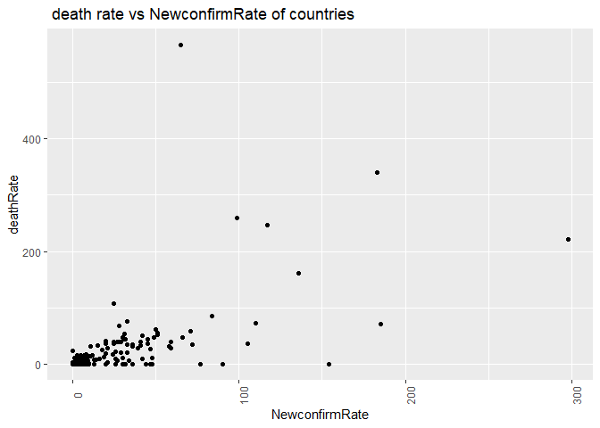
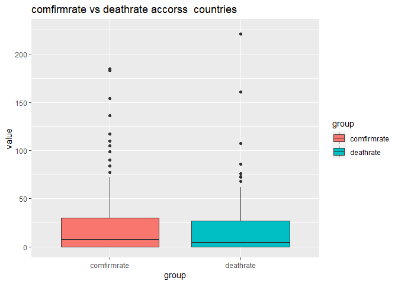

COVID19 API
================
Ipsita Datta
9/28/2021

     This document is a vignette to show how to retrieve data from Covid19API.
     To demonstrate, I'll be interacting with the Covid19 API. I am going to 
     build a few functions to interact with some of the endpoints and explore 
     some of the data I can retrieve.

# Requirements

To use the functions for interacting with the API, I used the following
packages:

-   [`tidyverse`](https://www.tidyverse.org/): useful features for data
    manipulation and visualization
-   [`jsonlite`](https://cran.r-project.org/web/packages/jsonlite/): API
    interaction
-   [`httr`](https://cran.r-project.org/web/packages/httr/index.html):
    For using function to interact with API

# API Interaction Functions

Here are the functions to interact with Covid19 API.

## `Country`

I wrote this function to interact with the `Country` endpoint of the
Covid19API. It returns all countries and associated provinces. The
country\_slug variable is used for country specific data

``` r
Country <-function(CountryName ="all"){
    #Returns all the available countries and provinces, as well as the country 
    #slug for per country requests.
  outputAPI<-GET("https://api.covid19api.com/countries")
  output<- outputAPI$content %>% rawToChar() %>% fromJSON()
  if ( CountryName != "all"){
         #if country name is in country
         if (CountryName %in% output$Country){
         # subset output for just that row.
         output<-output %>% filter(Country == CountryName)
         }
         # if country code in country slug
         else if (CountryName %in% output$Slug ){
          output<-output %>% filter(Slug == CountryName) 
         }
         # if country name is in countrycode/ISO2
         else if (CountryName %in% output$ISO2 ){
          output<-output %>% filter(CountryCode == CountryName) 
         }
  }
    # Return the output data.frame.
  
  return(output)
}
# for ex: Country() or Country("united-states") 
```

## `C_summary`

This function returns current cases for all the country and can also
return for single country if name passed as argument.

``` r
C_summary<-function(CountryName ="all"){
         ## Get all the number of cases from the summary endpoint.
         outputAPI<-fromJSON("https://api.covid19api.com/summary")
         output<-outputAPI$Countries
         if ( CountryName != "all"){
         #if country name is in country
         if (CountryName %in% output$Country){
         # subset output for just that row.
         output<-output %>% filter(Country == CountryName)
         }
         # if country name is in countrycode
         else if (CountryName %in% output$CountryCode ){
          output<-output %>% filter(CountryCode == CountryName) 
         }
         # if country code in country slug
         else if (CountryName %in% output$Slug ){
          output<-output %>% filter(Slug == CountryName) 
         }
          # Otherwise, throw an informative error.
          else {
          message <- paste("ERROR:Argument for country was not found in either",
                           "the Country or CountryCode or Slug columns. Try 
                           Countries('all') to","find the CountryName you're
                           looking for.")
      stop(message)
          }
}
          # Do nothing if the Country value equals "all".
else {
    
     }
        # Return the output data.frame.
        return(output)
}

#for ex: C_summary() or C_summary("united-states")
```

## `USAdetail`

Returns all live cases for All provinces of USA.It can be use for a
particular province with particular case type of USA too.These records
are pulled every 10 minutes and are ungrouped. Country must be the slug
from /countries or /summary. Cases must be one of: Deaths,Confirmed
,Active,Recovered

``` r
USAdetail<-function(ProvinceName ="all",type  ){
    baseurl<-"https://api.covid19api.com/live/country/united-states"
     output<-fromJSON(baseurl)
    # If Province does not equal "all", check if it is a Province .
        if (ProvinceName != "all" ){
           # If Province is in the Province column, subset output for just that 
           #row.
             if (ProvinceName %in% output$Province){
                 output <- output %>%
                           filter(ProvinceName == Province) %>%
                   select(all_of(type),Province)
            }
            # Otherwise, warn the user and return the entire dataframe.
            else {
            message <- paste("WARNING: Argument for Province was not found in 
                             either","the Province  columns. Returning all",
                       "or type should be Deaths,Confirmed ,Active,Recovered.")
           warning(message)
            }
          return(output)
         }
        # Do nothing if the province value equals "all".
        else {# Return the output data.frame.
              return(output)
              }
}
#for ex: USAdetail() or USAdetail("North Carolina","Active")
```

## `CountryDatabycase`

Get List Of Cases Per Country By Case Type From The First Recorded
Case.Returns all cases by case type for a country from the first
recorded case. Country must be the country\_slug from /countries. Cases
must be one of: confirmed, recovered, deaths or Active.

``` r
CountryDatabycase<-function(Country ="all",Status){
if (Country != "all"){
baseurl<-"https://api.covid19api.com/dayone/country/"
path1<-paste0(baseurl,Country)
endpoints<-"/status/"
fullurl<-paste0(path1,endpoints,Status)
outputAPI <-fromJSON(fullurl)
return(outputAPI)
}
  else{message <- paste("ERROR: Argument for country was not found in  Country")
      stop(message)
  }
}
#for ex: CountryDatabycase("south-africa","deaths")
```

## `Allcasesbycountry`

Returns all cases by case type for a country from the first recorded
case. Country must be the Slug from /countries or /summary. Cases must
be one of: confirmed, recovered, deaths or Active

``` r
Allcasesbycountry<-function(Country ="all" ,type){
if (Country != "all"){
baseurl<-"https://api.covid19api.com/dayone/country/"
fullurl<-paste0(baseurl,Country)
outputAPI<-fromJSON(fullurl)
output<- outputAPI %>% select(Country,type)
return(output)
}
else{message <- paste("ERROR: Argument for country was not found in  Country ")
      stop(message)
}
}
#For ex: Allcasesbycountry("Switzerland","Confirmed")
```

## `LiveCount`

Returns all cases by case type for a country from the first recorded
case with the latest record being the live count. Country must be the
Slug from /countries or /summary. Cases must be one of: confirmed,
recovered, deaths

``` r
Livecount<-function(Country="all",type){
if (Country !="all"){
baseurl<-"https://api.covid19api.com/dayone/country/"
path1<-paste0(baseurl,Country)
fullurl<-paste0(path1,"/status/",type,"/live")
outputAPI<-fromJSON(fullurl)
return(outputAPI)
}
  else{message <- paste("ERROR: Argument for country was not found in  Country")
      stop(message) }
}
#Livecount("iran","confirmed")
```

# Data Exploration

Now that we can interact with a few of the endpoints of the Covid19 API,
let’s get some data from them.<br>

First, let’s pull A function returns current cases for all the country
along with global cases

``` r
# Get the current cases for all of the country .
currentData<- C_summary()
```

Second, let’s pull a function returns cases by type for USA provinces.

``` r
#Get all the cases of unites-states.
currentData2<-USAdetail("Utah","Deaths")
currentData3<-USAdetail("Utah","Recovered")
Data<-cbind(currentData2,currentData3)
```

Now two variable of interest for me are detahrate and newconfirmed rate
per countries.

``` r
# Add a column for the death per 10000
currentData1 <- currentData %>%
  mutate(deathRate = round((NewDeaths*10000 )/ TotalDeaths,0),
      NewconfirmRate=round((NewConfirmed*10000 )/ TotalConfirmed,0)) %>% select (Country,deathRate,NewconfirmRate)
df<-as.data.frame(currentData1)

# Create a Bar Plot of deathRate per Country( last 10 country from the dataset).
plot1<-  ggplot(tail(df,30),aes(x=Country,y=deathRate,fill=deathRate)) 
 plot1+ geom_col() + 
  #  remove the legend.
  theme(axis.text.x=element_text(angle=90), legend.position="none") +
  # Set the axes labels.
  scale_x_discrete("Country") + 
  scale_y_continuous("DeathRate") +
  # Add a title.
  ggtitle("Last 10 country death rate from Current data") 
```

<!-- -->

``` r
# Create a scatter Plot of death rate vs NewconfirmRate of Countries
plot2<-df %>% ggplot(aes(x=NewconfirmRate,y=deathRate)) 
plot2+geom_point() + 
  theme(axis.text.x=element_text(angle=90), legend.position="none") +
  scale_x_continuous("NewconfirmRate") + 
  scale_y_continuous("deathRate") +
  ggtitle(" death rate vs NewconfirmRate of countries ")
```

<!-- -->

``` r
# Make a box plot of comfirmrate deathrate  of  countries.

a<-data.frame(group ="deathrate",value =df$deathRate)
b<-data.frame(group ="comfirmrate",value=df$NewconfirmRate)
plotData<-rbind(a,b)
g<-ggplot(plotData,aes(x=group,y=value,fill=group)) 
  g+geom_boxplot() + coord_cartesian(ylim=c(0,225))+
  ggtitle("comfirmrate vs deathrate accorss  countries ") 
```

<!-- -->

``` r
#Create a histogram of Newconfirmrate of  countries from data set.
g<-ggplot(df,aes(x=NewconfirmRate))
g+geom_histogram(binwidth = 30,color="blue",fill="red")+
  ggtitle("histogram of Newconfirmrate of  countries ")
```

<!-- -->

``` r
# Create a Bar Plot of NewConfirmed per Country( First 30 country from the 
# dataset).
plot3<-  ggplot(head(currentData,30),aes(x=Country,y=NewConfirmed,
                                         fill=NewConfirmed)) 
 plot3+ geom_col() + 
  #  remove the legend.
  theme(axis.text.x=element_text(angle=90), legend.position="none") +
  # Set the axes labels.
  scale_x_discrete("Country") + 
  scale_y_continuous("NewConfirmed") +
  # Add a title.
  ggtitle("First 30 country NewConfirmed cases from Current data") 
```

<!-- -->

### numerical summaries for all the countries

``` r
# It shows the numerical summeries on TotalConfirmed for all the countries
currentData %>% summarise(avg=round(mean(TotalConfirmed),0),
                          sd=round(sd(TotalConfirmed),0),
                          median=round(median(TotalConfirmed),0),
                          IQR=round(IQR(TotalConfirmed),0))
```

    ##       avg      sd median    IQR
    ## 1 1230753 4438431 164167 617446

### contingency table

here under var1 shows number of cases and the frequency of occurence of
that number of cases accross all the countries. For example,( var1=0 and
freq=86 ) It means there are 86 countries has currently zero new death
cases.

``` r
con_tb<-table(currentData$NewDeaths)
t1<-as.data.frame(con_tb)
t1
```

    ##    Var1 Freq
    ## 1     0   86
    ## 2     1   10
    ## 3     2    6
    ## 4     3    5
    ## 5     4    4
    ## 6     5    5
    ## 7     6    4
    ## 8     7    3
    ## 9     8    7
    ## 10    9    2
    ## 11   10    3
    ## 12   11    3
    ## 13   12    2
    ## 14   13    1
    ## 15   15    1
    ## 16   16    1
    ## 17   17    1
    ## 18   18    2
    ## 19   19    1
    ## 20   20    1
    ## 21   21    1
    ## 22   23    1
    ## 23   24    1
    ## 24   25    1
    ## 25   26    2
    ## 26   27    1
    ## 27   28    1
    ## 28   29    1
    ## 29   30    2
    ## 30   31    2
    ## 31   32    1
    ## 32   33    1
    ## 33   36    1
    ## 34   37    1
    ## 35   39    5
    ## 36   44    1
    ## 37   45    1
    ## 38   46    1
    ## 39   51    2
    ## 40   57    1
    ## 41   68    1
    ## 42   81    1
    ## 43   94    1
    ## 44  105    1
    ## 45  123    1
    ## 46  125    1
    ## 47  150    1
    ## 48  217    1
    ## 49  233    1
    ## 50  282    1
    ## 51  318    1
    ## 52  339    1
    ## 53  530    1
    ## 54  790    1
    ## 55  910    1
    ## 56 2556    1
